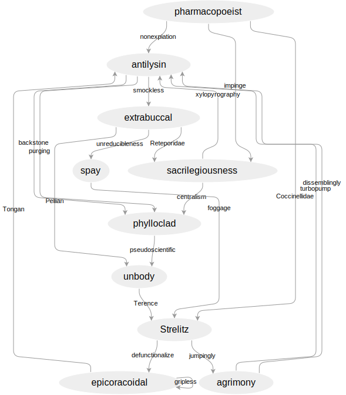

# 'Arrowic

O frabjous day! Callooh! Callay! Yet another tiny, incomplete clojure
wrapper around a Java library!

In this case, the
simplest
[directed graph](https://en.wikipedia.org/wiki/Directed_graph) viewer
possible for those situation where you are in the process of
interrogating some data and would like to how it looks as boxes and
arrows.

I love `graphviz` as much as the next former-AT&T employee, but it's
rather nice to be able to generate an *interactive* graph layout from
within `emacs` (or whatever your REPL of choice), tinker with it by
hand, then export it to SVG.

Note! There are no options for formatting at present. All graphs look
like this:



## Usage

A new empty graph is created using `create-graph`. The graph thus
created can then be mutated in place inside of a `with-graph` form
using `insert-vertex!` and `insert-edge!`.

``` clojure
;; grab some words from the UNIX dictionary
(def words
  (into [] (clojure.string/split-lines (slurp "/usr/share/dict/words"))))

;; make a random graph full of words
(defn random-graph []
  (with-graph (create-graph)
    (let [vertices (repeatedly 10 #(insert-vertex! (rand-nth words)))]
      (doseq [edge-label (repeatedly 20 #(rand-nth words))]
        (insert-edge! (rand-nth vertices) (rand-nth vertices) edge-label)))))

(def graph (random-graph))

(def viewer (create-viewer graph))

(def another-graph (random-graph))

;; can change the currently viewed graph this way:
(view viewer another-graph)

;; export a graph to SVG
(spit "example.svg" (as-svg another-graph))

```

## License

Copyright © 2017 Jack Rusher

Distributed under the Eclipse Public License either version 1.0 or (at
your option) any later version.
